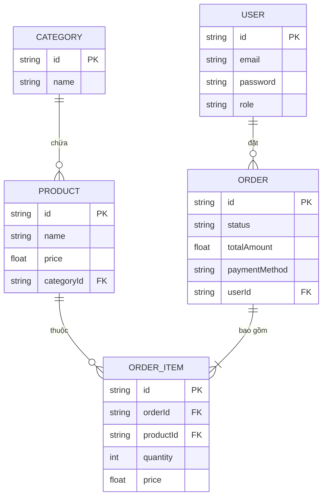

# Khảo sát Cơ sở dữ liệu (Database Schema)

Dự án sử dụng cơ sở dữ liệu quan hệ (Relational Database) và mô hình hóa mọi rành buộc khóa chính/khóa ngoại thông qua tệp khai báo `prisma/schema.prisma`.

## 1. Cấu trúc các Tables (Bảng dữ liệu)

### `User` (Người dùng / Nhóm phân quyền)
Lưu thông tin đăng nhập và quyền sử dụng nền tảng (Role).
- **role**: Phân ra `admin`, `editor`, `user`.
- **Relationship**: 1 User có thể sỡ hữu nhiều Đơn hàng (`Order`).

### `Category` (Danh mục sản phẩm)
Chứa các danh mục phân loại nhánh nhỏ (Ví dụ: Máy tính xách tay, Điện thoại, Phụ kiện...).
- **Relationship**: 1 Category sẽ chứa nhiều Sản phẩm (`Product`). 

### `Product` (Sản phẩm)
Khai báo dữ liệu vật lý bày bán.
- Quan hệ N-1 với `Category` (Qua trường khóa ngoại `categoryId`).
- Thuộc tính mở rộng như: `price`, `imageUrl`, `description`.

### `Order` (Đơn đặt hàng)
Bảng quan trọng nhất trong hệ thống Thương mại. Ghi nhận giao dịch mua của Customer.
- **status**: Trạng thái hiện tại (vd: `pending`, `processing`, `shipped`, `delivered`, `cancelled`).
- Liên kết với người mua qua `userId`.

### `OrderItem` (Chi tiết Đơn hàng)
Đây là bảng trung gian cắt lớp (Pivot Table giữa Order và Product trong mô hình N-N thực tế của rổ hàng - Shopping Cart).
- Giúp tra vết xem một đơn hàng (`Order`) có những sản phẩm (`Product`) cụ thể nào.
- Có lưu lại `price` cắt tại thời điểm mua (Tránh trường hợp sau này sản phẩm tăng/giảm giá làm sai lệch Hóa đơn gốc định dạng). Ghi chú thêm `quantity` (Số lượng mua).

## 2. Diagram Thiết kế

